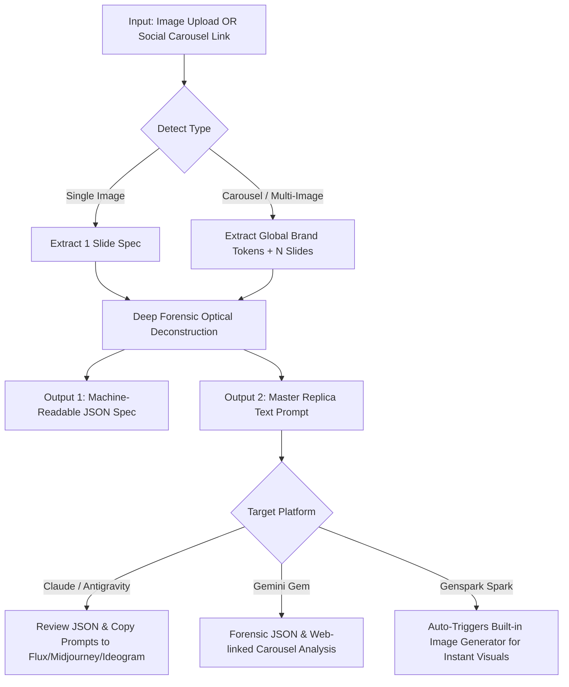

# Vision Forensic Engine: Ultra-Depth Image-to-JSON & AI Image Replication Guide

This master blueprint elevates the Medium "Vision-to-JSON" concept into an ultra-deep forensic optical reverse-engineering engine. It extracts pixel-level technical data (photographic physics, 3D materials, verbatim typography, and lighting architecture) and outputs synchronized JSON specifications and master text prompts.

---

## 1. Architecture Comparison: Standard vs. Forensic Ultra-Depth

| Dimension | Standard Medium Article Method | Vision Forensic Ultra-Depth (This System) |
| :--- | :--- | :--- |
| **Photographic Physics** | Basic "camera, lighting" strings | Hasselblad/Sony sensor, exact lens focal length (mm), aperture (f/1.2–f/8), shutter speed, ISO noise, bokeh geometry, depth of field falloff curve |
| **Lighting Architecture** | "Studio lighting" | 3-point lighting setup, key light angle & Kelvin temperature (e.g. 5200K), fill ratio, kicker/rim angles, ambient occlusion, contact shadow blur radius |
| **Materials & 3D Assets** | Vague descriptions | Exact refraction IOR, transmission, frosted glass roughness, subsurface scattering, chrome specular falloff, claymorphism/glassmorphism |
| **Typography & Copy** | Summarized or partial text | **100% Verbatim Transcription Guarantee**, zero typos, exact casing (ALL_CAPS/Title Case), font anatomy (Geometric Sans, High-Contrast Serif), hex colors, spatial coordinates |
| **Social Media & Carousels** | Single image only | Single image **AND** multi-slide carousels (LinkedIn, Instagram, Facebook), with **Global Brand Tokens** to keep colors, fonts, and layout 100% consistent across all slides |
| **Dual Output** | Raw JSON only | **Structured JSON Schema** + **Production-Ready Master Text Prompt** (optimized for Flux.1, Midjourney v6.1, Ideogram 2.0, DALL-E 3) |
| **Genspark Automation** | None | Detects slides, extracts JSON, and **automatically generates the replica images** inside Genspark |

---

## 2. Component File Index in Workspace

All configuration and instruction files have been created in your workspace:

1. [SKILL.md](file:///d:/Karan/seo/.agents/skills/forensic-image-to-json/SKILL.md) — Standard Antigravity and Claude-compatible Skill.
2. [gemini-gem-system-instructions.md](file:///d:/Karan/seo/.agents/skills/forensic-image-to-json/gemini-gem-system-instructions.md) — Ready-to-paste instructions for Google Gemini Custom Gem.
3. [genspark-agent-instructions.md](file:///d:/Karan/seo/.agents/skills/forensic-image-to-json/genspark-agent-instructions.md) — Ready-to-paste instructions for Genspark Custom Spark with auto-image generation.
4. [claude-project-prompt.md](file:///d:/Karan/seo/.agents/skills/forensic-image-to-json/claude-project-prompt.md) — Ready-to-paste instructions for Claude.ai Projects and Custom Instructions.

---

## 3. Workflow Diagram

---

## 4. Best Practices for Replication Across Image Generators
- **Ideogram 2.0**: Unmatched for rendering complex typographic layouts and exact text in quotes.
- **FLUX.1 (Pro / Schnell)**: Unrivaled for photorealistic skin textures, lighting physics, camera lens emulation, and complex multi-object composition.
- **Midjourney v6.1**: Superb for high-end aesthetic styling, editorial photography, and stylized 3D graphics (use `--ar 4:5 --v 6.1 --style raw`).
- **DALL-E 3**: Great for graphic illustration, vibrant 3D claymorphism, and straightforward adherence.
